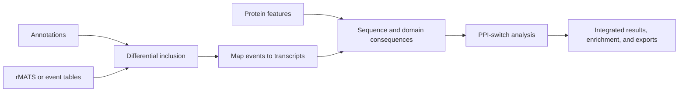

# SpliceImpactR Studio

SpliceImpactR Studio is a Shiny interface for exploring how alternative
splicing can alter transcripts, protein sequence, domains, and protein-protein
interactions. It provides an interactive workflow around the
[SpliceImpactR R package](https://github.com/fiszbein-lab/SpliceImpactR).



## Workflow

1. **Load annotations.** Use the small packaged test reference, a locally
   prepared GENCODE reference, or—in hosted mode—upload the official human
   GENCODE 45 GTF, transcript FASTA, and protein FASTA files through the
   browser. A deployment may also provide a read-only preprocessed GENCODE 45
   bundle for faster shared access.
2. **Load splicing evidence.** Use the demonstration workspace, upload a
   self-contained rMATS project ZIP with its sample manifest, or import a
   normalized raw-event or post-DI table. When present, `control` and `case`
   are selected as the default reference and comparison conditions.
3. **Load protein features.** Use packaged demonstration features, query
   supported feature sources through BioMart/Ensembl, or upload protein and
   exon feature tables.
4. **Run the analysis.** The full pipeline performs differential inclusion,
   transcript matching, sequence/frame comparison, domain analysis, and
   PPI-switch analysis. Results are available as bounded interactive previews,
   plots, enrichment summaries, provenance records, and downloadable tables.

The default PPI network is supplied by SpliceImpactR and loaded only when it is
needed. A compatible interaction table can also be uploaded for a session.

## Run locally

Install the dependencies recorded in `renv.lock`, including the pinned
SpliceImpactR revision, then launch the app from the repository root:

```r
renv::restore()
shiny::runApp(".")
```

To preview the hosted interface locally:

```sh
SPLICEIMPACTR_HOSTED=true Rscript -e 'shiny::runApp(".")'
```

## Data and references

This repository intentionally contains **code only**. It does not distribute
GENCODE references, user data, protein-feature downloads, PPI exports, caches,
or serialized analysis objects.

The app remains usable without external data through the example datasets in
SpliceImpactR. For full human analyses, obtain the matching GENCODE 45 source
files or prepare the following local preprocessed triplet:

```text
human_gencode_v45.gtf.rds
human_gencode_v45_sequences.rds
human_gencode_v45_hybrids.rds
```

These files remain untracked. If all three are present beside `app.R`,
`deploy_app.R` includes them in the deployment automatically; otherwise it
creates a source-only deployment with the test and browser-upload workflows.

Validate the deployment manifest without uploading anything:

```sh
SPLICEIMPACTR_DEPLOY_DRY_RUN=true Rscript deploy_app.R
```

## Verification

```sh
Rscript tests/testthat.R
Rscript tests/smoke_demo.R
```

The smoke test uses the full local reference when available and otherwise
validates the source-only demonstration workflow.
